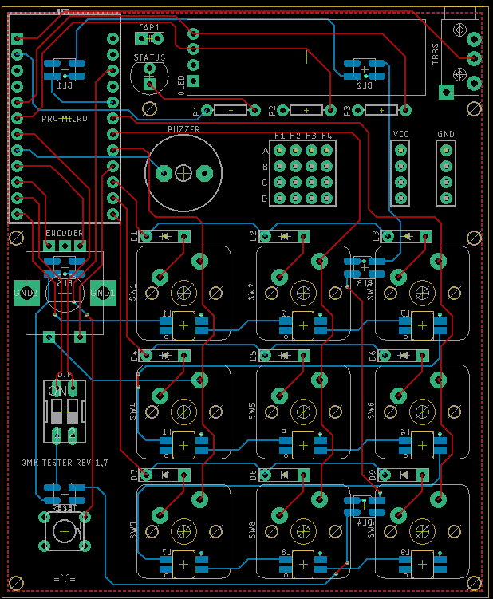

# qmk_tester

A board for testing out QMK features and prototyping keyboards. Currently supports:

- 3- and 5-pin MX-style switches
- RGB backlighting
- RGB underglow
- Buzzer
- DIP switch
- Status LED
- OLED screen
- Split

## Bill of materials

### Basics

- 1x pro-micro or compatible controller
- 9x MX-style switch
- 9x keycaps
- 9x 1N4148 diodes
- 1x LED
- 1x rotary encoder
- 1x 2-way DIP switch
- 1x 6mm momentary switch
- 1x PJ320A TRRS jack
- 1x 100μF capacitor
- 1x 100Ω resistor
- 2x 4.7kΩ resistor

### Lighting

- 9x 3535 WS2811 LED (per-key)
- 6x 3535 WS2811 LED (underglow)

### OLED

- 1x SSD1306 128x32 OLED

## Assembly

Assembly is pretty straightforward - the components are through-hole and mostly don't interfere with each other. First solder in the diodes as per the symbols on the PCB, then the per-key LEDs if required. After that, solder in the rest of the components as per the footprints on the board.

## Schematic

